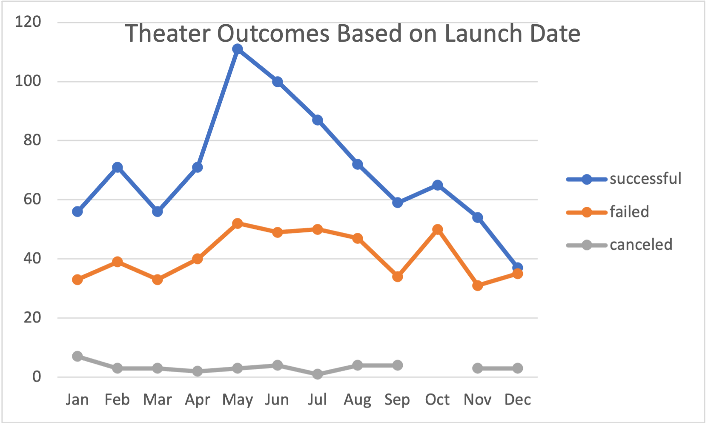
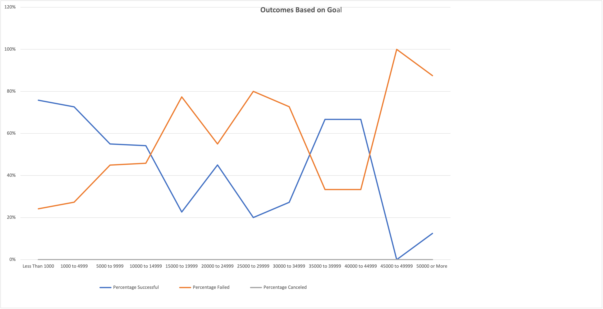

# Kickstarting with Excel

## Overview of Project

### Purpose
Louise wants to know how different campaigns fared in relation to their launch dates and their funding goals. From the Kickstarter data that Louise provided to us we were able to visualize campaign outcomes based on their launch dates and their funding goals.

## Analysis and Challenges

### Analysis of Outcomes Based on Launch Date

There are more successful campaigns than failed or canceled campaigns; this is a good sign because if Louise decides to launch a campaign it has a high chance of being successful. The month of May has the highest successful campaigns out of every month, so Louise should launch her campaign in this month for a better chance at a successful campaign.

### Analysis of Outcomes Based on Goals

Campaigns that have a goal  of less than $1000 has the highest percentage of being successful. Louise should set her goal in that range if she wants to launch a successful campaign. Campaigns with a goal between $45000 to $49999 have a guaranteed rate of failure, Louise should avoid that range for her goal.

### Challenges and Difficulties Encountered
Some challenges I encountered while analyzing this data was using the COUNTIF formula because it had multiple factors. I overcame this challenge by researching and using my resources. I had some difficulties creating my tables and graphs because of the many field name options available. I overcame this by experimenting with my options until my tables and charts were correct.

## Results

- What are two conclusions you can draw about the Outcomes based on Launch Date?
There are more successful campaigns than failed campaigns, and the month of May has the highest successful and failed campaigns out of every month.

- What can you conclude about the Outcomes based on Goals?
Campaigns with a goal between $45000 to $49999 have a 100% rate of failue.

- What are some limitations of this dataset?
Since some of the data is specified to a specific subcategory, their is no information about the number of canceled plays which can skew our data. 

- What are some other possible tables and/or graphs that we could create?
We could have used a pie chart to illustrate some of our data because of the use of percentages. 
